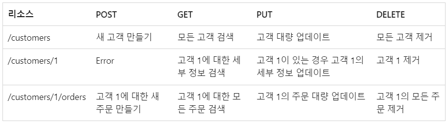

# 1. HTTP의 이해

### 학습 키워드

* HTTP(Hypertext Transfer Protocol)
* HTTP와 HTTPS의 차이(TLS)
* 클라이언트-서버 모델
* stateless와 stateful
* HTTP Cookie와 HTTP Session
* HTTP 메시지 구조
  * HTTP 요청(Reuqest)와 응답(Response)
    * multipart/form-data
  * HTTP 요청 메서드(HTTP request methods)
    * 멱등성
  * HTTP 응답 상태 코드(HTTP response status code)
    * 리다이렉션

***

### HTTP(Hypertext Transfer Protocol)

*   HTML과 같은 하이퍼미디어 문서를 전송하기 위한 **애플리케이션 레이어** 프로토콜

    * 프로토콜 : 원활하게 소통하기 위한 규칙, 집합, 규약, 약속
    * 애플리케이션 레이어 : OSI 7계층
      * 2, 3, 4, 7계층만 확인
        * 2계층 - 데이터 링크 계층 ⇒ MAC address
          * 각 기기를 MAC address로 식별함
        * 3계층 - 네트워크 계층 ⇒ IP address
          * 직접 연결되지 않은 기기간의 서로를 인식할 수 있는 방법
        * 4계층 - 전송 계층 → TCP, UDP ⇒ Port number
          * 프로그램들간의 연결
        * 7계층 - 응용 계층 → HTTP 등
          * HTTPS를 위한 TLS 같은 보안 계층이 먼저 들어갈 수도 있다.

### HTTP와 HTTPS의 차이(TLS)

* HTTPS : HTTP를 암호화하여 전송 (중간  매개체에서 통신 내용을 확인할 수 없다)
* TLS 위에 HTTP 프로토콜을 얹어 보안된 HTTP 통신을 하는 프로토콜

### 클라이언트-서버 모델

* 클라이언트 (고객) -> 요청
* 서버 (종업원) -> 응답
* 서비스/리소스 요청 -> URL (어떤  요청인지 구분하기 위해)

### stateless와 stateful

* 무상태(stateless) - 클라이언트와 서버 관계에서 서버가 클라이언트의 상태를 보존하지 않음을 의미(HTTP)&#x20;
  * 클라이언트는 항상 자신이 누구인지 알려줘야 한다.
    * 쿠키, 세션, 웹 브라우저 기능(localStorage 등)
  * 장점 : 서버의 확장성이 높기 때문에 대량의 트래픽 발생 시에도 대처를 수월하게 할 수 있다.
  *   단점 : 클라이언트의 요청에 상대적으로 stateful 보다 더 많은 데이터가 소모된다.

      <figure><figcaption></figcaption></figure>
*   상태유지(stateful) - 클라이언트와 서버 관계에서 서버가 클라이언트의 상태를 보존함을 의미

    <figure><figcaption></figcaption></figure>

### HTTP Cookie와 HTTP Session

* 쿠키
  * 클라이언트에 저장되는 키와 값이 들어있는 작은 데이터 파일
  * 클라이언트의 상태 정보를 로컬에 저장했다가 참조
* 세션
  * 세션은 쿠키를 기반하고 있지만 사용자 정보 파일을 브라우저에 저장하는 쿠키와 달리 세션은 서버 측에서 관리
  * 정보를 서버에 두기 때문에 보안에 좋지만 사용자가 많아질수록 서버 메모리를 많이 차지하게 됨

### HTTP 메시지 구조

#### HTTP 요청(Reuqest)와 응답(Response)

* 사람이 읽을 수 있는 형태 (텍스트)
* 요청과 응답이 모두 동일한 구조

<figure><figcaption></figcaption></figure>

* Start line → 요청과 응답의 형태가 다름.
  * 실행되어야 할 요청, 또은 요청 수행에 대한 성공 또는 실패가 기록되어 있다
* Headers
  * 요청에 대한 설명, 혹은 메시지 본문에 대한 설명이 들어간다
* 빈 줄
  * 요청에 대한 모든 메타 정보가 전송되었음을 알리는 빈 줄이 삽입된다
* Body
  * 요청과 관련된 HTML이나 문서 등이 들어가며 본문의 존재나 크기는 첫줄과 HTTP 헤더에 명시된다

#### multipart/form-data

* 한 Body 에서 두 종류의 데이터를 구분에서 넣어주는 방법도 필요해서 등장
* 여러 메세지들을 하나로 모아서 보내주는 방식

#### HTTP 요청 메서드(HTTP request methods)

* 주소를 통해서 무엇을 할것인지 메서드를 통해서 결정

1. GET → Read
2. HEAD → GET without body (바디  없이 헤더만)
3. POST → Submit (멱등성X) ⇒ Collection Pattern에서 Create로 사용
   1. ex) 회원가입 -> 처음 가입후 다시 가입할때 이미 가입된 아이디  이다 -> 멱등성 보장X
4. PUT → Update (+Create) ⇒ Overwrite!
5. PATCH → Update (partial) (멱등성X)
   1. 부분적 업데이트 -> PUT 과 다르게 일부분만 업데이트 가능
6. DELETE → Delete
7. OPTIONS → 지원 확인

#### 멱등성&#x20;

* 같은 행위를 여러 번 반복하더라도 같은 효과를 가져야 한다

#### HTTP 응답 상태 코드(HTTP response status code)

1. 1xx → 정보 ⇒ 우리가 직접 쓰는 일은 드믐.
2. 2xx → 성공 ⇒ 200 OK, 201 Created, 204 No Content
3. 3xx → 리다이렉션 ⇒ 304 Not Modified가 특수한 형태로 자주 보임.
   1. 304 Not Modified -> 응답이 바뀌지 않았음을 알려줌 (캐시를  그대로 사용)
4. 4xx → 클라이언트 쪽 문제 ⇒ 404 Not Found
5. 5xx → 서버 쪽 문제 ⇒ 500 Internal Server Error

#### 리다이렉션

* 다른 페이지로 옮겨주는 것
