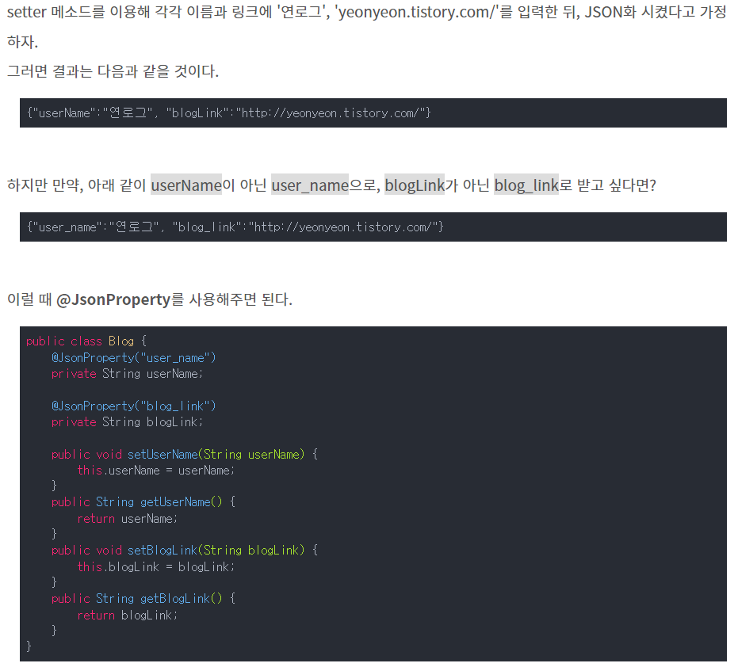

# 3. Jackson ObjectMapper

### 학습 키워드

- Jackson ObjectMapper 란
- ObjectMapper
- @JsonProperty

***

### Jackson ObjectMapper 란
* Java에서 DTO(데이터)를 JSON(문자열)으로, JSON(문자열)을 DTO(데이터)로 변환하기 위해 사용하는 라이브러리
* Spring에서는 아무런 코드를 추가하지 않더라도 요청과 응답을 Jackson ObjectMapper가 변환해준다.

### ObjectMapper
* ObjectMapper를 직접 사용하면 직렬화 역직렬화가 가능하다.
* 자바 객체를 JSON String이나 바이트 배열로 변환해주고,
* JSON 문자열을 Java 객체로 변환해준다.
* ObjectMapper는 생성시 비용이 많이 들기 때문에 Bean이나 static으로 생성해서 재사용 하도록 권장하고 있다.

### @JsonProperty
* JSON 직렬화 시 설정할 수 있는 이름을 지정하는 어노테이션
* JSON 변환 시 변수명과 JSON name이 다른 경우

