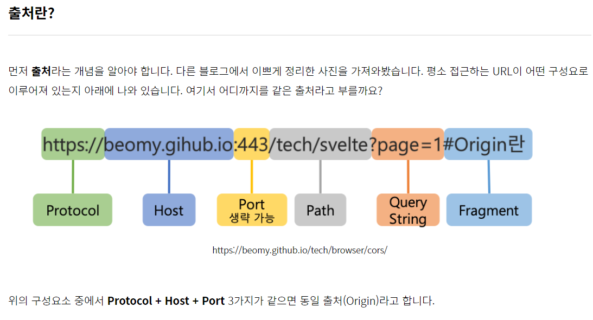

# 4. CORS

### 학습 키워드

- CORS 란
    - 동일 출처 정책
    - JSONP
    - Access-Control-Allow-Origin
- @CrossOrigin

***

### CORS 란 (Cross-Origin Resource Sharing)
* 브라우저에서는 보안적인 이유로 cross-origin HTTP 요청들을 제한한다.
* 그래서 cross-origin 요청을 하려면 서버의 동의가 필요하다.
* 만약 서버가 동의한다면 브라우저에서는 요청을 허락하고, 동의하지 않는다면 브라우저에서 거절한다.
* 이러한 허락을 구하고 거절하는 메커니즘을 HTTP-header를 이용해서 가능한데, 이를 CORS(Cross-Origin Resource Sharing)라고 부른다.
* 브라우저에서 cross-origin 요청을 안전하게 할 수 있도록 하는 메커니즘이다.

#### 동일 출처 정책 (Same Origin Policy, SOP)
* 어떤 출처에서 불러온 문서나 스크립트가 다른 출처에서 가져온 리소스와 상호작용하는 것을 제한하는 중요한 보안 방식
* 잠재적으로 해로울 수 있는 문서를 분리함으로써 공격받을 수 있는 경로를 줄여준다.
* 자신과 동일한 도메인만 서버로부터 데이터를 요청하여 받을 수 있도록 하는 정책

#### JSONP (JSON with Padding)
* 클라이언트 단이 아닌, 다른 도메인에 있는 서버로부터 데이터를 요청하는 경우 사용되는 데이터 포맷이다. 
* JSON데이터를 클라이언트가 지정한 콜백함수로 감싸(padding) 클라이언트에 전송한다. 
* 자바스크립트는 서로다른 도메인에 대한 요청을 보안상 제한한다. 
* 개발을 하다보면 어절 수 없이 다른 도메인으로부터 데이터를 가져오는 상황이 발생하는데 이러한 이슈 때문에 JSONP방식을 사용한다.
* callback은 서버에서 지원해 주어야 한다.
* SOP 정책으로 인해 생기는 이슈를 Cross-domain issue라고 하는데 JSONP는 이 이슈를 우회해서 데이터 공유를 가능하게 하였다.

#### Access-Control-Allow-Origin
* 서버에서 헤더에 Access-Control-Allow-Origin을 추가하여 CORS 설정이 가능하다.
* 모든 곳에 허용할 수 있고, 원하는 출처에만 허용해줄 수 있다.
* 보통은 백엔드 - 프론트 연결로 같은 서비스이지만 출처가 다른 경우 등록을 해준다.
* 쿠키의 경우 기본적으로는 CORS 설정이 안되지만,
* Access-Control-Allow-Origin을 * 이 아닌 정확한 출처를 적은 경우에
* Access-Control-Allow-Credentials을 사용해서 전달할 수 있다.

### @CrossOrigin
* CORS를 스프링을 통해 설정할 수 있는 기능이다.
* 기본적으로 '모든 도메인, 모든 요청방식' 에 대해 허용 한다는 뜻이다.
