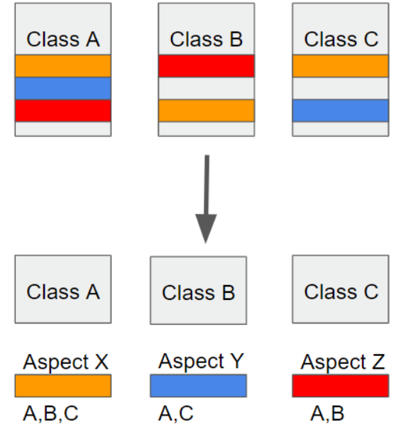

# 1. Dependency Injection

### 학습 키워드

- Spring AOP(Aspect Oriented Programming)
- Dependency Injection
- 싱글턴 패턴
- IoC(Inversion of Control)
- Spring Bean
- BeanFactory

***

### Spring AOP(Aspect Oriented Programming) - 관점 지향 프로그래밍
* 정의
    * 어떤 로직을 기준으로 핵심적인 관점, 부가적인 관점으로 나누어서 보고 그 관점을 기준으로 각각 모듈화하겠다는 것
    * 핵심적인 관점은 비즈니스 로직이 될 수 있고, 부가적인 관점은 핵심 로직을 실행하기 위해 행해지는 데이터베이스 연결, 로깅, 파일 입출력 등이 될 수 있다. 

    * 모듈화 - 어떤 공통된 로직이나 기능을 하나의 단위로 묶는 것

* 왜 필요한가/왜 생겼는가
> 

    위와 같이 흩어진 관심사를 Aspect로 모듈화하고 핵심적인 비즈니스 로직에서 분리하여 재사용하겠다는 것이 AOP의 취지이다.

* 특징 (또는 장/단점)
    * 프록시 패턴 기반의 AOP 구현체

    * 프록시 객체를 쓰는 이유는 접근 제어 및 부가기능을 추가하기 위해서이다.

    * 스프링 빈에만 AOP를 적용 가능

    * 모든 AOP 기능을 제공하는 것이 아닌 스프링 IoC와 연동하여 엔터프라이즈 애플리케이션에서 가장 흔한 문제(중복코드, 프록시 클래스 작성의 번거로움, 객체들 간 관계 복잡도 증가 ...)에 대한 해결책을 지원하는 것이 목적

### Dependency Injection

* 의존성(Dependency) - 코드에서 두 모듈간의 연결을 의미

* 정의
    * 객체의 생성과 사용 관심사를 분리하는 프로그래밍 설계 방식

    * 필요한 객체를 직접 생성하는 것이 아닌 외부로 부터 필요한 객체를 받아서 사용하는 것

    * 이를 통해 객체간의 결합도를 줄이고 코드의 재활용성을 높여준다.

* 왜 필요한가/왜 생겼는가
    * 예를들어 A는 B에 의존하고, B는 C에 의존하고 있는 상황을 가정해본다.

    * 이때, C가 변경되면 B를 변경해야하고, 이어서 A를 변경해야한다.

    * 이와 같은 문제는 순환 의존의 형태에서 심하게 발생할 수 있다. 

* 장점
    * 코드의 재사용성, 유연성이 높아진다. 하나의 작업만 수행하는 작은 객체는 많은 상황에서 재결합하고 재사용하기가 쉽기 때문이다.

    * 객체간 결합도가 낮기 때문에 한 클래스를 수정했을 때 다른 클래스도 수정해야 하는 상황을 막아준다

    * 유지보수가 쉬우며 테스트가 용이해진다

    * 확장성을 가진다

* 단점
    * 책임이 분리되어 있기 때문에 클래스 수를 늘림으로써 복잡성이 증가한다.

    * 주입된 객체들에 관한 코드 추적이 어렵다.

    * 초기 개발 노력이 필요하다.

    * 의존성 주입 프레임워크를 사용하면 빌드 시간이 늘어날 수 있으며, 프레임워크에 대한 의존도를 높인다.

### 싱글턴 패턴

* 정의

    * 객체의 인스턴스가 오직 1개만 생성되는 패턴

    * 최초 한번만 메모리를 할당(static)

    * 이 인스턴스를 어디서나 사용할 수 있도록 하는 디자인 패턴

    * 생성자가 여러 차례 호출되더라도 실제로 생성되는 객체는 하나

* 왜 필요한가/왜 생겼는가

    * 객체의 유일무이함을 보장하면서 어디서든지 그 객체에 접근할 수 있게 하기 위해 등장하였다.

* 특징

    * 고정된 메모리 영역을 얻으면서 동시에 단 한번만 new 를 사용하여 메모리 낭비를 방지할 수 있다.

    * 싱글톤으로 만들어진 인스턴스는 전역으로 사용됨. 즉, 다른 클래스의 인스턴스 들이 데이터를 공유하고 변경할 수 있다.
    
    * 너무 많은 일을 위임하거나 공유할 경우 Coupling이 많아지고 결합도가 높아진다.

### IoC(Inversion of Control)

* 정의

    * 오직 하나의 객체만을 생성할 수 있는 클래스

    * 객체를 개발자가 아닌 외부(스프링 컨테이너)에서 생성, 관리

    * 클래스들의 객체를 일일이 프로그래머가 다루는 것이 아니라 스프링에게 관리를 맡기게 하는것

    * 이때 스프링이 객체들을 미리 생성해 관리하는 공간을 <b>스프링 컨테이너</b>라고 하며

    * 이렇게 스프링에 의하여 생성되고 관리되는 자바 객체를 스프링에선 <b>빈(Bean)</b>이라고 한다.

* 왜 필요한가/왜 생겼는가

    * 메모리 측면의 이점

    * 속도 측면의 이점

    * 데이터 공유가 쉽다

* 장점

    * 고정된 메모리 영역을 얻으면서 한번의 new로 인스턴스를 사용하기 때문에 메모리 낭비를 방지할 수 있다.

    * 싱글톤으로 만들어진 클래스의 인스턴스는 전역이기 때문에 다른 클래스의 인스턴스들이 데이터를 공유하기 쉽다.

    * 인스턴스가 절대적으로 한 개만 존재하는 것을 보증하고 싶을 경우 사용한다.

    * 두 번째 이용시 부터는 객체 로딩 시간이 줄어 성능이 좋아지는 장점이 있다.

* 단점

    * 인스턴스가 너무 많은 일을 하거나 많은 데이터를 공유시킬 경우에 다른 클래스의 인스턴스들 간에 결합도가 높아진다.

    * 의존성이 높아지면 수정이 어려워지고 유지보수의 비용이 높아질 수 있다.

    * 멀티쓰레드 환경에서 동기화 처리를 안하면 인스턴스가 2개가 생성 될 수 있는 가능성이 생기게 된다.

### Spring Bean

* 정의

    * Spring IoC 컨테이너가 관리하는 자바 객체

    * 컨테이너에 의해 생명주기가 관리되는 객체

    * IoC 컨테이너 안에 들어있는 객체로 필요할 때마다 IoC 컨테이너에서 가져와서 사용한다.

    * 즉, Spring 에서는 Bean은 ApplicationContext가 알고 있는 객체이며 ApplicationContext가 생성하고 직접 관리해주는 객체를 의미한다.

* 왜 필요한가/왜 생겼는가

    * 직접 의존성을 주입하기 위해서는 의존 관계를 모두 파악해야하는 번거로움이 생긴다. 

    * 또한 많은 객체가 중복 생성될 수 있다.

    * 그래서 의존성 주입이 필요한 객체를 Bean으로 등록하여 스프링 IoC 컨테이너가 객체의 생성과 의존성 주입을 관리하도록 해야한다.

* 장점

    * 서비스를 생성하는 곳에서 변경을 신경쓰지 않아도 된다.

    * 직접 의존관계를 모두 파악하고 주입해주지 않아도 된다.

### BeanFactory

* 정의

    * 객체를 생성하고 객체 사이의 런타임 의존관계를 맺어주는 역할을 하는 스프링 컨테이너의 최상위 인터페이스

    * 빈을 생성하고 의존관계를 설정하는 기능을 담당하는 가장 기본적인 IoC 컨테이너이자 클래스를 말한다.

* 특징 (또는 장/단점)

    * Bean을 등록, 생성, 조회, 반환 관리를 한다.

    * 팩토리 디자인 패턴을 구현한 것으로 BeanFactory는 빈을 생성하고 분배하는 책임을 지는 클래스이다.

    * Bean을 조회할 수 있는 getBean() 메소드가 정의되어 있다. 보통 getBean()이 호출되면, 팩토리는 의존성 주입(DI)을 이용해 빈을 객체로 만들어 빈의 특성을 설정하기 시작한다. 이것을 빈의 일생이 시작된다고 이야기하기도 한다.
    
    * 보통은 BeanFactory를 바로 사용하지 않고, 이를 확장한 ApplicationContext를 사용한다.

