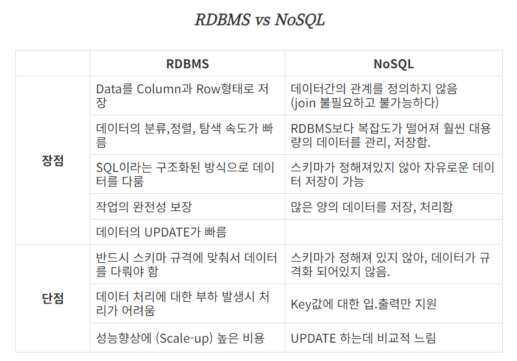

# 1. Database

## 학습 키워드

- Database 란
- DBMS(Database Management System)
- RDBMS(Relational Database Management System)
- 데이터베이스 언어
  - DDL
  - DML
  - DCL
- SQL
- 데이터 모델(Data Model)
  - 관계형 데이터 모델
- 튜플

***

### Database 란

- 구조화된 정보 또는 데이터의 조직화된 모음 (데이터의 집합)

- 데이터베이스는 일반적으로 데이터베이스 관리 시스템(DBMS)에 의해 제어된다.

- 사용자 DB라고 하면 사용자 정보가 쌓여있는 걸 의미하지만, 개발하면서 DB라고 하면 사실은 DBMS를 의미할 때가 많다.

### DBMS(Database Management System)

- 데이터베이스를 운영하고 관리하는 소프트웨어

- 다양한 데이터가 저장되어 있는 데이터베이스는 여러 명의 사용자나 응용 프로그램과 공유하고 동시에 접근이 가능해야 한다.

- 장점

  -자료의 통합서을 증진시키고 데이터의 접근이 용이하다.

  - 데이터의 통제가 쉬워지고 프로그램들을 쉽게 개발하고 관리할 수 있다.

  - 중복 데이터를 업애고 정리해서 유지보수가 쉽다.

  - 장애 발생시 회복이 가능하고 표준화가 가능하다.

- 단점

  - 고비용이고 중앙 집중 관리로 취약점이 존재한다.

  - 백업과 회복하는 방법이 복잡하다.

#### RDB

- 관계형 데이터 모델에 기초를 둔 데이터 베이스

- 모든 데이터를 2차원의 테이블 형태로 표현한다.

### RDBMS(Relational Database Management System)

- 정의

  - RDB를 생성하고 수정하고 관리할 수 있는 소프트웨어이다.

  - 관계형 모델을 기반으로 하는 DBMS 유형이다.

  - RDBMS의 테이블은 서로 연관되어 있어 일반 DBMS보다 효율적으로 데이터를 저장, 구성 및 관리할 수 있다.

  - RDBMS는 DBMS의 한 유형이다.

- 장단점



### 데이터베이스 언어

#### DDL(Data Definition Language)

- 테이블과 같은 데이터 구조를 정의하는데 사용되는 명령어들로 (생성, 변경, 삭제, 이름변경) 데이터 구조와 관련된 명령어들을 말한다.

  ex) CREATE, ALTER, DROP, RENAME, TRUNCATE

#### DML(Data Manipulation Language)

- 데이터베이스에 들어 있는 데이터를 조회하거나 검색하기 위한 명령어를 말하는 것

  ex) SELECT

- 데이터베이스의 테이블에 들어 있는 데이터에 변형을 가하는 종류(데이터 삽입, 수정, 삭제)의 명령어들을 말한다.

  ex) INSERT, UPDATE, DELETE

#### DCL(Data Control Language)

- 데이터베이스에 접근하고 객체들을 사용하도록 권한을 주고 회수하는 명령어들을 말한다.

  ex) GRANT, REVOKE

### SQL

- 관계형 데이터베이스에 정보를 저장하고 처리하기 위한 프로그래밍 언어이다.

- SQL 문을 사용하여 데이터베이스에서 정보를 저장, 업데이트, 제거, 검색 및 검색할 수 있다.

### 데이터 모델(Data Model)

- 정의

  - 현실 세계의 정보들을 컴퓨터에 표현하기 위해서 단순화, 추상화 하여 체계적으로 표현한 개념적 모형이다.

  - 데이터, 데이터의 관계, 데이터의 의미 및 일관성, 제약조건 등을 기술하기 위한 개념적 도구들의 모임이다.

  - 현실 세계를 데이터베이스에 표현하는 중간 과정, 즉 데이터베이스 설계 과정에서 데이터의 구조를 논리적으로 표현하기 위해 사용되는 도구이다.

  - 데이터의 구조(Schema)를 논리적으로 묘사하기 위해 사용되는 지능적 도구이다.

1. Conceptual Data Model

    - 개념적 데이터 모델

    - 모델의 범위인 도메인의 의미 체계를 설명 (조직의 관심 영역 모델)

    - 데이터베이스 설계가 아닌 조직의 의미를 나타내므로 추상화 수준으로 존재할 수 있다.

    - 물리적 세부 사항은 숨기고 엔티티, 데이터 유형, 관계 및 제약 조건을 설명하는 데 목표를 둔다.

2. Logical Data Model

    - 논리적 데이터 모델

    - 정보 도메인의 추상적 구조를 나타냄

    - 특정 데이터베이스와 독립적으로 테이블, 클래스, XML 같은 구조로 표현된다.

    - 개념적 데이터 모델에서 식별된 구조를 기반으로 만들어진다.

    - 비즈니스 프로세스에서 일반적으로 사용되며, 검증이 끝나면 물리적 데이터 모델의 기초가 된다.

3. Physical Data Model

    - 물리적 데이터 모델

    - 데이터베이스 관리 시스템에서 구현되었거나, 구현될 예정인 데이터 설계를 표현

    - 완전한 물리적 데이터 모델에는 테이블간의 관계, 인덱스, 제약 조건 정의, 연결 테이블, 클러스터 등

    - 성능 목표를 달성하는데 필요한 모든 데이터베이스 아티팩트가 포함된다.

#### 관계형 데이터 모델

- 모든 데이터를 관계로 그룹화된 튜플로 표현하는 데이터 모델

- 관계형 모델에 따라 구성된 데이터베이스를 관계형 데이터베이스라고 한다.

- 관계형 모델의 목적은 데이터와 쿼리를 지정하는 선언적 방법을 제공하는 것이다.

### 튜플

- (속성, 값) 쌍의 집합

- 하나의 집합에서 속성 이름은 유일하기 때문에, 속성 이름은 겹치지 않는다.

- ex)

```text
{ (이름/문자열, 견우), (나이/정수, 13), (성별/문자, 남) }
```

- 대개는 Row, Record로 구현된다.

- 튜플은 집합이기 때문에 중복을 허용하지 않지만, 대부분의 RDBMS는 중복을 허용한다. 그리고 RDBMS는 NULL도 허용한다.