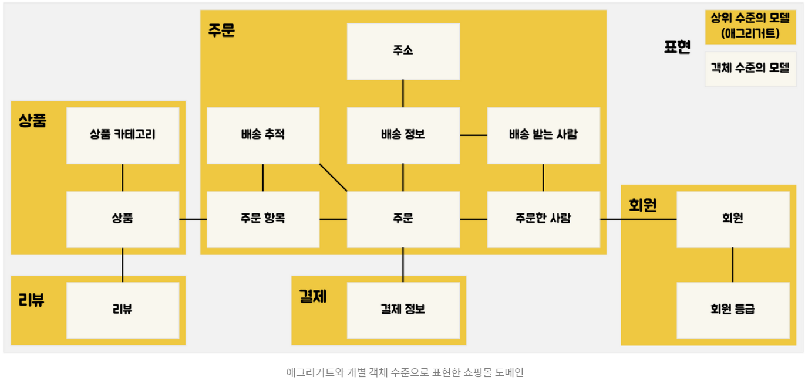

# 4. Relationship Mapping

## 학습 키워드

- N + 1 problem
- DDD의 Aggregate
- CascadeType.ALL
- orphanRemoval
- Event Sourcing
- JPA 어노테이션
  - @OneToMany
  - @JoinColumn

***

### N + 1 problem

- 여러 번의 select 문이 순식간에 여러 개가 나가는 현상

- 연관 관계가 설정된 엔티티를 조회할 경우에 조회된 데이터 갯수(n) 만큼 연관관계의 조회 쿼리가 추가로 발생하여 데이터를 읽어오는 현상

- N+1 쿼리 문제 발생 시기

  - 두 개의 엔티티가 1:N 관계를 가지며 JPQL로 객체를 조회할 때

    1. EAGER 전략으로 데이터를 가져오는 경우

    2. LAZY 전략으로 데이터를 가져온 이후에 가져온 데이터에서 하위 엔티티를 다시 조회하는 경우

- 해결 방법

  - 패치 조인(Fetch Join)

    - 미리 쿼리로 테이블을 조인해서 가져오기 때문에 LAZY, EAGER 두개의 전략에 해당되는 해결법이다.

  - Batch Size 조절

    - 설정한 Size만큼 데이터를 미리 로딩한다.

### DDD의 Aggregate

- 관련된 객체들을 모아 하나의 단위로 취급하는 개념

- 객체 간의 관계를 정의하는 방법 중 하나

- 논리적으로 관련된 객체들을 그룹화하여 하나의 묶음으로 다룬다.

- 여러 개의 객체를 묶어 하나의 큰 객체로 다루는 것이다.



<br/>

#### 영속성전이(CASCADE)란 ?

- 부모 엔티티가 영속화될 때 자식 엔티티도 같이 영속화되고, 부모 엔티티가 삭제될 때 자식 엔티티도 삭제되는 등 특정 엔티티를 영속 상태로 만들 때 연관된 엔티티도 함께 영속 상태로 전이되는 것을 의미합니다.

### CascadeType.ALL

- CascadeType.ALL: 모든 Cascade를 적용, 상위 엔터티에서 하위 엔터티로 모든 작업을 전파

- CascadeType.PERSIST: 엔티티를 영속화할 때, 연관된 엔티티도 함께 유지

- CascadeType.MERGE: 엔티티 상태를 병합(Merge)할 때, 연관된 엔티티도 모두 병합

- CascadeType.REMOVE: 엔티티를 제거할 때, 연관된 엔티티도 모두 제거

- CascadeType.DETACH: 부모 엔티티를 detach() 수행하면, 연관 엔티티도 detach()상태가 되어 변경 사항 반영 X

- CascadeType.REFRESH: 상위 엔티티를 새로고침(Refresh)할 때, 연관된 엔티티도 모두 새로고침

### orphanRemoval

- Entity들 사이의 연관관계를 정의할 때 사용할 수 있는 옵션

- 부모가 자식에 대한 참조를 끊을 때, 참조가 끊어진 자식 Entity(고아 객체)를 DB에서 삭제하도록 설정할 수 있다.

> CascadeType.ALL + orphanRemovel=true

- 이 두개를 같이 사용하게 되면 부모 엔티티가 자식의 생명주기를 모두 관리할 수 있게 된다.

### Event Sourcing

- 데이터 저장 방식의 한 종류

- 기존에는 APP 상에서 특정 로직을 처리한 이후에 DB에는 해당 로직의 결과값만 담는 식으로 진행해 왔다.

- 그러나 이벤트 소싱은 DB가 변경되는 순간의 모든 이벤트를 저장한다.

- 영속 데이터를 어떤 식으로 저장할 것인지에 관한 것

- 도메인 객체를 생성하고, 상태를 변경하기 위해 발생하는 이벤트(Event)들을 DB에 저장함으로써 위에 언급한 문제들의 해결을 시도한다.

- 도메인 객체에 대한 변경 이벤트를 모두 추적할 수 있으며,
이벤트는 한 번 발생한 이후 수정되지 않기 때문에 UPDATE나 DELETE 없이 항상 INSERT 작업만 일어난다.

- 따라서 동시성 문제로부터 비교적 자유롭다.

### JPA 어노테이션

- Java 애플리케이션에서 엔티티 간의 관계를 정의하고 구성하는 데 사용되는 JPA 주석이다.
- 관계형 데이터베이스의 테이블 간 관계를 Java 애플리케이션의 해당 개체에 매핑하는 데 도움이 된다.

#### @OneToMany

- 1:N 관계를 설정하는 어노테이션

``` java
@OneToMany(mappedBy = "school", cascade = CascadeType.ALL)
private List<Student> students = new ArrayList<>();
```

- mappedBy를 설정해줌으로써 주인이 아니다라는 뜻을 줄 수 있다.

- mappedBy 값은 주인에서 사용하는 외래키 필드명을 적어w준다.

- mappedBy를 설정해주는 것이 필수는 아니다.

#### @JoinColumn

``` java
JoinColumn(name = "TEAM_ID")
```

- 외래 키를 매핑할 때 사용한다.

- name 속성에는 매핑 할 외래 키 이름을 지정한다.

> @OneToMany 및 @JoinColumn은 일반적으로 JPA의 엔터티 간에 일대다 관계를 설정하기 위해 함께 사용된다.
<br>
@OneToMany 주석은 상위 엔티티의 컬렉션 필드에 적용되고 @JoinColumn 주석은 상위 엔티티를 참조하는 하위 엔티티의 필드에 적용된다.