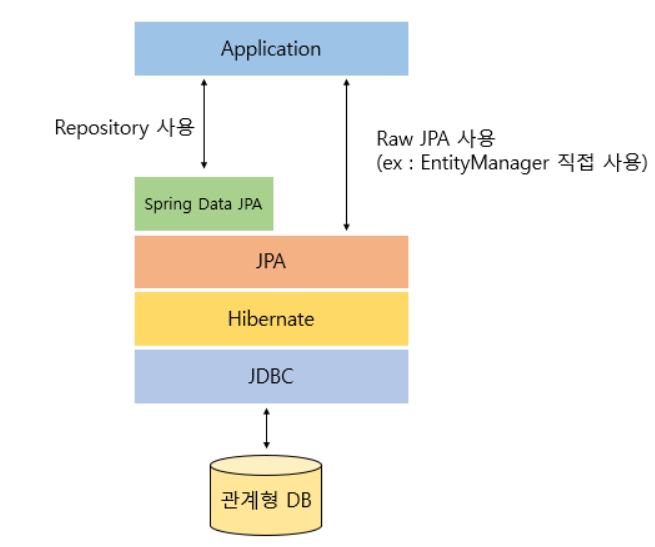

# 5. Spring Data JPA

## 학습 키워드

- Spring Data JPA
- Dao 와 Repository 차이
- JPA Repository와 DDD의 Repository
- Spring AOP
- @Transactional

***

### Spring Data JPA

- JPA를 사용하기 편하도록 만들어놓은 모듈

- JPA를 한 단계 더 추상화시킨 Repository 인터페이스를 제공한다.

- Hibernate와 같은 JPA구현체를 사용해서 JPA를 사용하게 된다.

- 사용자는 더욱 간단하게 데이터 접근이 가능해진다.

### Dao 와 Repository 차이

#### Dao

- 퍼시스턴스 로직을 캡슐화하고 도메인 레이어에 객체 지향적인 인터페이스를 제공하는 객체

- 데이터 퍼시스턴트의 추상화 이다.

- 테이블 중심의 데이터베이스와 가깝게 고려 된다.

- 그래서 DAO는 데이터 베이스 테이블과 매치 된다. 데이터 CRUD를 위한 방법을 제공한다.

#### Repository

- DAO는 퍼시스턴스 레이어에 속한다. 반면 REPOSITORY의 인터페이스는 도메인 레이어에 속한다.

- DAO는 DB와 가까운 존재고, Repository는 도메인과 가까운 존재이다.

#### 차이점

- DAO는 데이터 지속성의 추상화이지만 레포지토리는 객체 컬렉션의 추상화이다.

- DAO는 데이터 소스에 가까운 더 하위 개념이다. 그러나 레포지토리는 도메인 개체에 가까운 상위개념이다.

- DAO는 쿼리를 숨기는 데이터 매핑/액세스 계층이다. 그러나 레포지토리는 도메인과 데이터 액세스 사이의 계층으로 데이터를 수집하고 도메인 개체를 준비하는 복잡성을 숨긴다.

- DAO에서 레포지토리를 사용 할 수 없다. 그러나 레포지토리에서는 기본 스토리지에 접근하기 위해 DAO를 사용할 수 있다.

- 빈약한 도메인이 있다면 레포지토리와 DAO는 같은 역할을 한다.

  - 빈약한 도메인 모델은 도메인 객체들에 비즈니스 로직이 거의 없거나 아예 없는 소프트 웨어 도메인 모델 이다.

### JPA Repository와 DDD의 Repository

#### JPA Repository

- 구현클래스없이 인터페이스만 작성해도 개발을 완료할 수 있도록 지원해준다.

- Entity하나에 대해서 다음과 같은 기능을 제공

  - save() : insert, update

  - findOne() : primary key로 레코드 하나 찾기

  - findAll() : 전체 레코드 불러오기 (sort, pageable 가능)

  - count() : 레코드개수

  - delete() : 레코드삭제

#### DDD의 Repository

- JPA가 entity 단위였다면 DDD의 repository는 Aggregate 단위로 repository를 만든다.

- Aggregate 단위의 repository가 aggregate의 원자성을 보장하게 된다.

- 일반적으로 DDD 에서는 하나의 Aggregate 를 Repository 의 대상 엔티티로 삼는다.

> 요약하면 JPA 저장소는 JPA 프레임워크에서 제공하는 저장소 인터페이스의 특정 구현이며 JPA를 사용한 데이터 액세스 및 지속성 작업에 중점을 둔다.
 
반면 DDD의 Repository는 집계/엔티티와의 상호 작용을 추상화하는 도메인 계층 내의 개념으로, 도메인 모델이 특정 데이터 액세스 기술이나 프레임워크에 묶이지 않고 개체와 함께 작동할 수 있도록 한다.

### Spring AOP

- 스프링 프레임워크에서 제공하는 기능 중 하나로 관점 지향 프로그래밍을 지원하는 기술이다.

- 로깅, 보안, 트랜잭션 관리 등과 같은 공통적인 관심사를 모듈화 하여 코드 중복을 줄이고 유지 보수성을 향상하는데 도움을 준다.

- Spring AOP는 Spring 프레임워크와 통합되어 Spring 관리 빈에 aspect를 적용하는 방법을 제공한다.

- Aspect, Pointcuts 및 Advice를 정의하기 위해 XML 및 주석 기반 구성을 모두 지원한다.

- 핵심 비즈니스 로직과 별도로 교차 편집 문제를 모듈화하고 관리할 수 있으므로 코드 모듈성, 재사용성 및 유지 관리성이 향상된다.

### @Transactional

- 트랜잭션과 같이 한가지 일을 하는 일련의 코드들을 한 단위로 묶어서 작업을 처리하는 방법

- 중간에 오류가 생겼을 경우에 작업 이전으로 되돌려주는 역할

- 수행하는 작업에 대해 위 트랜잭션 원칙이 지켜지도록 보장해주는 것

- 직접 객체를 만들지 않고, 선언만 해도 이 과정이 적용되어서 선언적 트랜잭션이라고도 표현한다.

- class레벨의 어노테이션은 선언된 클래스와 그의 서브클래스 내부에 있는 모든 메소드에 적용된다.