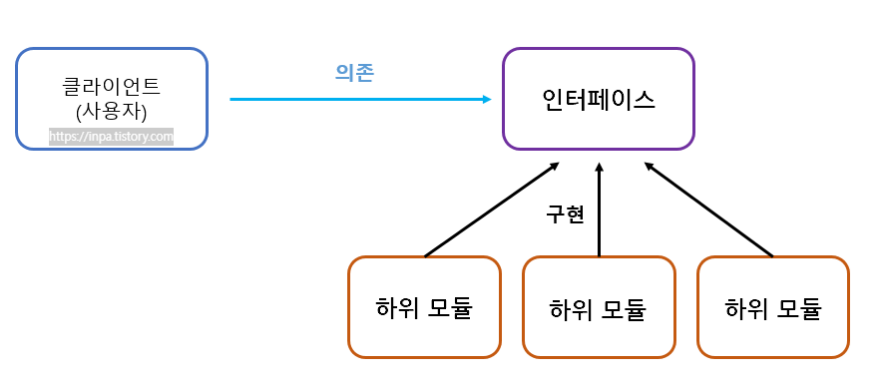

# 1. SOLID

## 학습 키워드

- SOLID (객체 지향 설계)
  - SRP (Single Responsibility Principle, 단일 책임 원칙)
  - OCP (Open-Closed Principle, 개방-폐쇄 원칙)
  - LSP (Liskov Substitution Principle, 리스코프 치환 원칙)
  - ISP (Interface Segregation Principle, 인터페이스 분리 원칙)
  - DIP (Dependency Inversion Principle, 의존관계 역전 원칙)

***

### SOLID (객체 지향 설계)

- 객체 지향 프로그래밍 및 설계의 다섯 가지 기본 원칙

- 프로그래머가 시간이 지나도 유지 보수와 확장이 쉬운 시스템을 만들고자 할 때 이 원칙들을 함께 적용할 수 있다.

#### SRP (Single Responsibility Principle, 단일 책임 원칙)

- 응집도(cohesion)를 다루는 설계 원칙

- 엉클 밥은 이를 “한 클래스는 단 한 가지의 변경 이유만을 가져야 한다”고 이야기한다.

- 클래스는 하나의 기능만 가지며 클래스가 제공하는 모든 서비스는 그 하나의 책임(변화의 축, 기능)을 수행하는 데 집중되어 있어야 한다는 원칙이다.

- 프로그램의 유지보수 성을 높이기 위한 설계 기법이다.

#### OCP (Open-Closed Principle, 개방-폐쇄 원칙)

- 소프트웨어 개체(클래스, 모듈, 함수 등)는 확장에 대해 열려 있어야 하고, 수정에 대해서는 닫혀 있어야 한다.

  1. Open: 모듈의 기능을 변경할 수 있어야 한다.
  2. Close: 변경이 다른 곳으로 퍼져나가지 않아야 한다.

- 이 목표는 추상화를 통해 달성 가능하고, Java에서는 interface를 활용한다.

- 어떤 모듈의 기능을 하나 수정할 때, 그 모듈을 이용하는 다른 모듈들 역시 줄줄이 고쳐야 한다면 유지보수가 복잡할 것이다.

- 따라서 개방 폐쇄 원칙을 잘 적용하여 기존 코드를 변경하지 않아도 기능을 새롭게 만들거나 변경할 수 있도록 해야 한다.

- OCP 는 추상화 (인터페이스) 와 상속 (다형성) 등을 통해 구현해낼 수 있다. 자주 변화하는 부분을 추상화함으로써 기존 코드를 수정하지 않고도 기능을 확장할 수 있도록 함으로써 유연함을 높이는 것이 핵심이다.

#### LSP (Liskov Substitution Principle, 리스코프 치환 원칙)

- “서브타입(subtype)은 그것의 기반 타입(base type)으로 치환 가능해야 한다.”

- 다형성 원리를 이용하기 위한 원칙 개념으로 보면 된다.

- LSP를 지키고 있는지 파악하는 방법 중 하나는 상속이 “행위” 측면에서 Is-A 관계인지 파악하는 것이다.

- 상위 클래스 타입으로 객체를 선언하여 하위 클래스의 인스턴스를 받으면, 업캐스팅된 상태에서 부모의 메서드를 사용해도 동작이 의도대로 흘러가야 하는 것을 의미하는 것이다.

- 상속관계에서는 꼭 일반화 관계 (IS-A) 가 성립해야 한다는 의미

- 예를들어 Collection 타입의 객체에서 자료형을 LinkedList에서 전혀 다른 자료형 HashSet으로 바꿔도 add() 메서드를 실행하는데 있어 원래 의도대로 작동되기 때문이다.

- 한마디로 다형성 이용을 위해 부모 타입으로 메서드를 실행해도 의도대로 실행되도록 구성을 해줘야 하는 원칙이라 이해하면 된다.

#### ISP (Interface Segregation Principle, 인터페이스 분리 원칙)

- 응집력이 없는 커다란 인터페이스를 여러 개의 작은 인터페이스로 나눌 것을 제안한다.

- 한 클래스에서 자신이 사용하지 않는 인터페이스는 구현하지 말아야 한다.

- 하나의 일반적인 인터페이스보다 여러 개의 구체적인 인터페이스가 낫다.

- SRP 원칙이 클래스의 단일 책임을 강조한다면, ISP는 인터페이스의 단일 책임을 강조하는 것으로 보면 된다.

- 인터페이스는 제약 없이 자유롭게 다중 상속(구현)이 가능하기 때문에, 분리할 수 있으면 분리하여 각 클래스 용도에 맞게 implements 하라는 설계 원칙이라고 이해하면 된다.

#### DIP (Dependency Inversion Principle, 의존관계 역전 원칙)

- 상위 수준의 모듈은 하위 수준의 모듈에 의존해서는 안 된다. 둘 모두 추상화에 의존해야 한다.

- 추상화는 구체적인 사항에 의존해서는 안 된다. 구체적인 사항은 추상화에 의존해야 한다.

- 여기서 상위 수준의 모듈은 비즈니스 로직을 다루는 부분을 의미하고, 하위 수준의 모듈은 상위 수준의 모듈에서 호출하는 기술적인 부분을 의미한다.

- 어떤 Class를 참조해서 사용해야하는 상황이 생긴다면, 그 Class를 직접 참조하는 것이 아니라 그 대상의 상위 요소(추상 클래스 or 인터페이스)로 참조하라는 원칙

- 구현 클래스에 의존하지 말고, 인터페이스에 의존하라는 뜻

- 의존 관계를 맺을 때 변화하기 쉬운 것 또는 자주 변화하는 것보다는, 변화하기 어려운 것 거의 변화가 없는 것에 의존하라는 것

- 의존 역전 원칙의 지향점은 각 클래스간의 결합도(coupling)을 낮추는 것이다.
