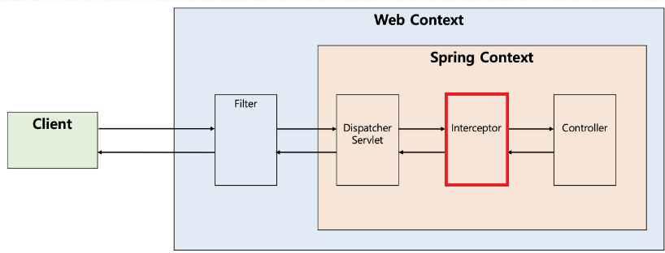
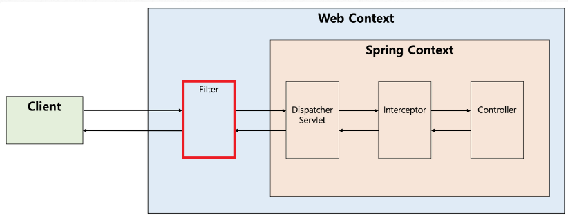
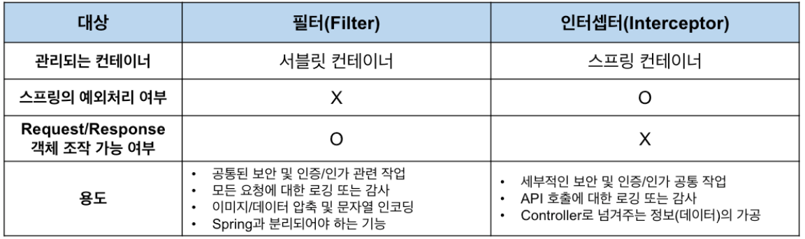

# 1. 애플리케이션 수준의 보안

## 학습 키워드

- 인증과 인가
- HTTP Stateless (1주차 복습)
- Cookie vs localStorage
- Interceptor vs Filter in Spring
- 암호화와 복호화
  - 단방향 암호화
  - Hashing algorithm
  - Salt가 필요한 이유

***

### 인증과 인가

#### 인증

- 통신 상에서 보내는 사람의 디지털 정체성을 확인하는 시도의 과정

- “나(사용자)는 누구인가?”라는 질문에 답하는 것

- 인증은 여러 층위에서 정의할 수 있는데, 사용자 경험 관점에서 인증은 로그인 단계를 의미한다.

#### 인가

- 인증이 증명의 문제라면, 인가는 허가의 문제다.

- 둘은 구분되지만, 일반적으로 인증과 인가는 함께 사용된다.

- 사용자가 로그인하면, 해당 사용자가 맞는지 확인하는 절차

- 예를 들어 쇼핑몰 서비스를 만든다고 하면 관리자만 모든 주문에 접근하고 처리할 수 있게 해야 한다.

- 이를 위해서 현재 사용자가 관리자임을 증명해야 하고(인증), 관리자가 아닌 사용자는 관리자 페이지에 접근할 수 없게 해야 한다(인가).

- 인증과 인가를 사용자, 클라이언트, 서버 입장에서 살펴보면 다음과 같다:

  1. 사용자 입장에서는 로그인 페이지를 통해 인증 절차를 밟게 되고, 그 이후는 접근이 거부될 때만 인가 과정이 있었음을 알 수 있게 된다.
  2. 클라이언트 입장에서는 로그인 과정을 통해 인증 결과로 토큰 등을 얻게 되고(세션을 활용한다면 Session ID를 통해 간접적으로 전달), 이를 쿠키나 localStorage 등으로 관리하면서 매 요청마다 서버로 전달한다. 즉, 매 요청마다 인가 과정이 있다고 가정한다.
  3. 서버 입장에서는 모든 요청에 대해 인증 작업이 수행된다. 로그인 등을 통해 발행한 토큰 등을 매번 확인해 사용자가 누구인지 알아내고(인증), 해당 사용자가 올바른 접근을 했는지 확인해서 허용 또는 금지한다(인가).

### HTTP Stateless (1주차 복습)

- [1. HTTP의 이해](../week01/1.http의_이해.md)

### Cookie vs localStorage

- 쿠키는 서버측과 클라이언트측 양쪽에서 쿠키 데이터를 사용하는 api가 존재한다.

- 이와 달리 localStorage는 로컬 환경에서만 컨트롤된다.

- 저장된 쿠키 데이터의 쓰임이 양쪽 모두이냐를 고려해야하며 만약 서버쪽 사용이 필수적이고 잦다면 로컬 저장소가 아닌 클라이언트와 서버와의 인터렉션이 좀 더 효과적인 쿠키값을 사용하는 것이 좋을 수도 있다.

#### Cookie

- 웹 사이트에 접속할 때 서버에 의해 사용자의 컴퓨터에 저장되는 정보

- 웹 사이트는 이렇게 저장된 사용자의 정보를 클라이언트(client) 측의 컴퓨터에 남겨서 필요할 때마다 재사용한다.

- 쿠키는 키와 밸류로 이루어져 있으며 만료기간, 도메인, 경로 등의 정보를 가지고 있다.

#### localStorage

- 로컬에 도메인 별로 지속되는 storage

- localStorage는 시간제한이 없고 브라우저가 꺼져도 죽지 않는다.

- 값을 지우려면 직접 지워줘야한다. (나는 지우기 직전까지 죽지않아)

- 클라이언트에 저장해야 하는 데이터를 저장

### Interceptor vs Filter in Spring

#### Interceptor

- 요청에 대한 작업 전 / 후로 가로챈다고 보면 된다.

- Dispatcher Servlet이 Controller를 호출하기 전 / 후에 인터셉터가 끼어들어 요청과 응답을 참조하거나 가공할 수 있는 기능을 제공한다.

- 웹 컨테이너에서 동작하는 필터와 달리 인터셉터는 스프링 컨텍스트에서 동작한다.

#### Filter

- 요청과 응답을 거른뒤 정제하는 역할을 한다.

- Dispatcher Servlet에 요청이 전달되기 전 / 후에 url 패턴에 맞는 모든 요청에 대해 부가 작업을 처리할 수 있는 기능을 제공한다.

- 즉, 스프링 컨테이너가 아닌 톰캣과 같은 웹 컨테이너에 의해 관리가 되는 것이고, 스프링 범위 밖에서 처리되는 것이다. (스프링 빈으로 등록 가능)

- **차이점**

### 암호화와 복호화

#### 암호화

- 암호화 알고리즘을 사용하여 암호화되지 않은 텍스트를 암호화된 텍스트로 변환하는 과정

#### 복호화

- 암호화된 텍스트를 암호화되지 않은 텍스트로 변환하는 과정

#### 단방향 암호화

- 암호화된 텍스트를 복호화할 수 없는 암호화 방식

- 패스워드 같이 복호화 하면 위험한 데이터에 사용

- 암호화된 텍스트를 복호화할 수 없기 때문에, 암호화된 텍스트를 비교하는 방식으로 사용

#### Hashing algorithm

- 단방향 암호화를 위한 알고리즘

- 입력값을 고정된 길이의 출력값으로 변환

- 입력값이 조금만 달라져도 출력값이 완전히 달라지는 특징

- 입력값이 같으면 출력값도 같다는 특징

#### Salt가 필요한 이유

- 입력값이 같으면 출력값도 같다는 특징 때문에, 레인보우 테이블을 통해 해킹이 가능하다.

- Salt를 사용하면 입력값이 같아도 출력값이 달라지기 때문에, 레인보우 테이블을 통한 해킹을 방지할 수 있다.

- Salt는 입력값과 같이 암호화되어 저장되어야 한다.

- 패스워드의 경우 반드시 Salt를 사용해서 암호화 해야 한다.
