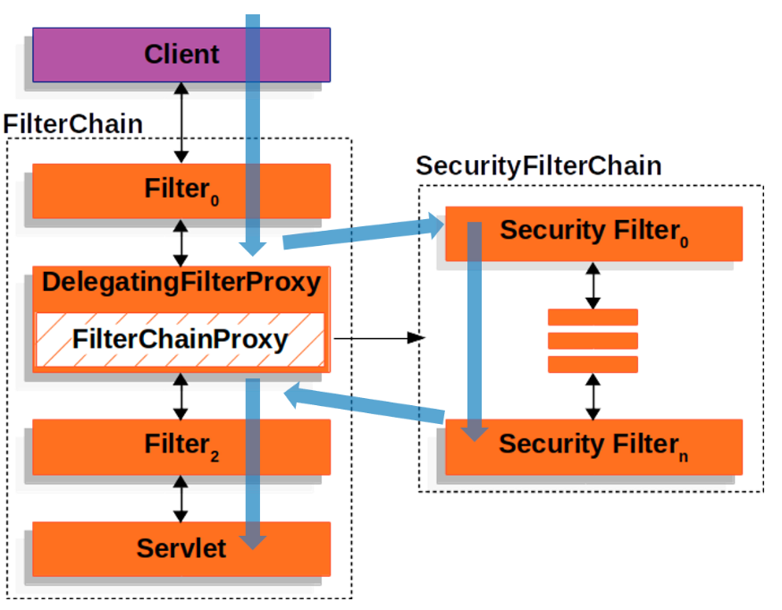
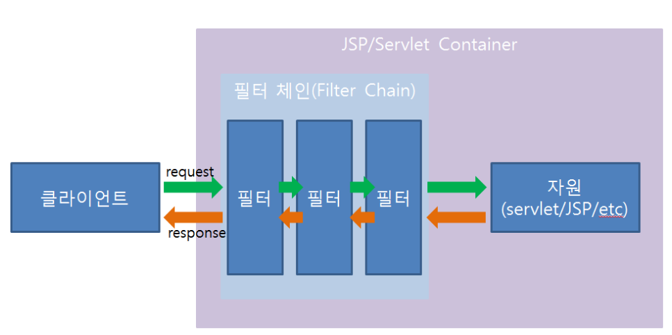

# 2. 인증

## 학습 키워드

- Identifier
- PostgreSQL (MySQL, MariaDB와 두드러지는 차별점)
- OAuth 2.0
- Bearer Token 옵션
- SecurityFilterChain
- `@Configuration`
- `@EnableWebSecurity`
- Filter vs OncePerRequestFilter
- FilterChain
- SecurityContext

***

### Identifier

- 어떤 대상을 유일하게 식별 및 구별할 수 있는 이름

- 사용자의 경우 해당 사용자인지 식별할 수 있는 식별자가 반드시 필요하다.

### PostgreSQL (MySQL, MariaDB와 두드러지는 차별점)

- 오픈소스다.

- 거의 모든 OS에서 사용가능하며, 라즈베리 파이 등 상용 하드웨어에서도 사용가능하다.

- 복잡한 쿼리와 대량 데이터를 효율적으로 처리할 수 있는 고급 쿼리 최적화 도구가 있다.

- 다중 버전 동시성 제어(MVCC)를 지원한다.

### OAuth 2.0

- OAuth 2.0은 인터넷 사용자들이 비밀번호를 제공하지 않고 다른 웹사이트 상의 자신들의 정보에 대해 웹, 모바일 및 데스크톱 애플리케이션들이 접근할 수 있는 방법을 제공하는 것이다.

- 인증(Authentication)과 권한부여(Authorization)를 위한 표준 프로토콜이다.

- 사용자의 ID와 비밀번호 없이도 접근 권한을 위임 받을 수 있는 표준 인증 프로토콜이다.

- 다른 웹사이트(구글, 네이버, 카카오 등)에서 제공하는 API를 이용하여 웹사이트나 애플리케이션의 접근 권한을 부여할 수 있는 공통적인 수단으로써 사용된다.

### Bearer Token 옵션

- OAuth 2.0 및 기타 인증/권한 부여 프로토콜에서 사용되는 액세스 토큰 유형

- 클라이언트 애플리케이션이 리소스 소유자(사용자)를 대신하여 보호된 리소스에 액세스할 수 있도록 하는 보안 자격 증명 역할을 한다.

- 인증 서버에서 생성되며 인증에 성공한 후 클라이언트에 부여된다.

- Bearer Token의 'Bearer'이라는 용어는 토큰이 특정 보안 컨텍스트나 사용자 신원과 연결되지 않으며, 토큰을 소유한 사람은 누구나 보호된 리소스에 액세스할 수 있음을 의미

- 클라이언트를 인증하는 데 필요한 정보를 전달하므로 무단 액세스를 방지하기 위해 안전하게 기밀로 유지해야 한다.

### SecurityFilterChain

- Spring Security는 인증 처리 과정을 서블릿이 제공하는 필터를 기반으로 처리한다.

- FilterChain과 SecurityFilterChain으로 나뉘어지는데, FilterChain은 기존 WAS의 필터 체인이고 오른쪽의 SecurityFilterChain은 스프링 시큐리티에서 사용하는 필터 체인이다.

- DelegationgFilterProxy: HTTP 요청을 가져와야 하기 때문에 특별한 필터(DelegationgFilterProxy)를 FilterChain에 추가하여 SecurityFilterChain과 연결시켜 주는 역할을 한다.

### @Configuration

- 설정파일을 만들기 위한 어노테이션 or Bean을 등록하기 위한 어노테이션

- 클래스에 적용되어 빈을 생성하는 클래스임을 표기한다.

- 이 클래스는 한개 혹은 그 이상의 @Bean 메서드를 선언함을 표기한다.

- 런타임 중에 Bean Definition 을 생성하고 해당 빈들에 대한 서비스 요청을 생성한다. 이는 보통 스프링 컨테이너에 의해 처리된다.

### @EnableWebSecurity

- web security 구성정보를 활성화하기 위해 사용된다.

- 스프링에 인증 및 권한을 제공하는 보안 구성을 적용하도록 신호를 보낸다.

- 주로 WebSecurityConfigurerAdapter 클래스를 상속하여 사용한다.

- 기본 보안 설정을 제공하고 메서드 오버라이딩을 통한 보안 커스터마이징을 제공한다.

### Filter vs OncePerRequestFilter

- 공통점 : 서블릿 마다 호출이 된다.

- 서블릿은 사용자의 요청을 받으면 서블릿을 생성해 메모리에 저장해두고, 같은 클라이언트의 요청을 받으면 생성해둔 서블릿 객체를 재활용하여 요청을 처리한다.

#### Filter

- HTTP 요청과 응답을 변경할수 있는 재사용 가능한 코드

- 필터는 객체의 형태로 존재하며 클라이언트로부터 오는 요청(Request)과 최종자원(서블릿/JSP)사이에 위치하며 클라이언트의 요청정보를 알맞게 변경할수 있으며, 또한 필터는 최종 자원과 클라이언트로 가는 응답(Response) 사이에 위치하여 최종 자원의 요청 결과를 알맞게 변경할수 있다.

- javax.servlet-api나 tomcat-embed-core를 사용하면 제공되는 Servlet Filter Interface이다.

- Filter를 조금 더 확장하여 스프링에서 제공하는 필터가 있는데 그것이 바로 GenericFilterBean이다.

- GenericFilterBean은 기존 Filter에서 얻어올 수 없는 정보였던 Spring의 설정 정보를 가져올 수 있게 확장된 추상 클래스이다.

- 이 서블릿이 다른 서블릿으로 dispatch되는 경우 문제가 된다.

- 문제점

  - Spring Security에서 인증과 접근 제어 기능이 Filter로 구현되어진다.

  - 이러한 인증과 접근 제어는 RequestDispatcher 클래스에 의해 다른 서블릿으로 dispatch되게 되는데 이 때 이동할 서블릿에 도착하기 전에 다시 한번 filter chain을 거치게 된다.

  - 바로 이 때 또 다른 서블릿이 우리가 정의해둔 필터가 Filter나 GenericFilterBean로 구현된 filter를 또 타면서 필터가 두 번 실행되는 현상이 발생할 수 있다.

- 이런 문제를 해결하기 위해 등장한 것이 **OncePerRequestFilter**이다.

#### OncePerRequestFilter

- 이름에서도 알 수 있듯이 모든 서블릿에 일관된 요청을 처리하기 위해 만들어진 필터이다.

- 이 추상 클래스를 구현한 필터는 사용자의 한번에 요청 당 딱 한번만 실행되는 필터를 만들 수 있다.

### FilterChain

- Filter가 여러개 모여서 하나의 체인을 형성하는 것

- 단일 HTTP 요청을 처리하는 전형적인 레이어, 여러개의 Filter들이 사슬처럼 연결되어 있고 서로 연결되어 연쇄적으로 동작함

- 체인을 형성하여 순서를 지정하며 실제로 요청 자체를 처리하려는 경우 필터가 나머지 체인을 거부 할 수 있다.

- 다운스트림 필터와 서블릿을 사용해서 요청과 응답을 수정할 수도 있다.

- Filter는 FilterChain 안에 있을 때 효력을 발휘

### SecurityContext

- Pod 또는 Container의 권한부여, 환경설정, 접근 제어를 제어하는 기능을 제공함.

- Container 프로세스들이 사용하는 사용자(runAsUser)와 그룹(fsGroup), 용량, 권한 설정, 보안 정책(SELinux/AppArmor/Seccomp)을 설정하기 위해 사용됨
