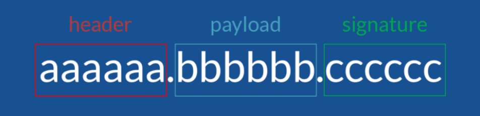
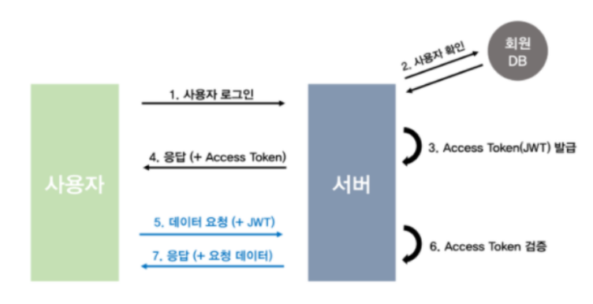

# 5. JWT & Authority

## 학습 키워드

- JWT
- Claims-based identity
- 대칭키 암호화 / 공개키 암호화
- `@Secured`

***

### JWT (Json Web Token)

- 정의

  - 일반적으로 클라이언트와 서버 사이에서 통신할 때 권한을 위해 사용하는 토큰이다.

  - Json 포맷을 이용하여 사용자에 대한 속성을 저장하는 Claim 기반의 Web Token이다.

  - 토큰 자체를 정보로 사용하는 Self-Contained 방식으로 정보를 안전하게 전달한다.

  - 주로 회원 인증이나 정보 전달에 사용된다.

- 구성요소

  

  - JWT는 헤더(header), 페이로드(payload), 서명(signature) 세 파트로 나눠져 있다.

  - 헤더 (Header)

    - 어떠한 알고리즘으로 암호화 할 것인지, 어떠한 토큰을 사용할 것 인지에 대한 정보가 들어있다.

  - 정보 (Payload)

    - 전달하려는 정보(사용자 id나 다른 데이터들, 이것들을 클레임이라고 부른다)가 들어있다.
    payload에 있는 내용은 수정이 가능하여 더 많은 정보를 추가할 수 있다. 그러나 노출과 수정이 가능한 지점이기 때문에 인증이 필요한 최소한의 정보(아이디, 비밀번호 등 개인정보가 아닌 이 토큰을 가졌을 때 권한의 범위나 토큰의 발급일과 만료일자 등)만을 담아야한다.

  - 서명

    - 가장 중요한 부분으로 헤더와 정보를 합친 후 발급해준 서버가 지정한 secret key로 암호화 시켜 토큰을 변조하기 어렵게 만들어준다.
    한가지 예를 들어보자면 토큰이 발급된 후 누군가가 Payload의 정보를 수정하면 Payload에는 다른 누군가가 조작된 정보가 들어가 있지만 Signatute에는 수정되기 전의 Payload 내용을 기반으로 이미 암호화 되어있는 결과가 저장되어 있기 때문에 조작되어있는 Payload와는 다른 결과값이 나오게 된다.
    이러한 방식으로 비교하면 서버는 토큰이 조작되었는지 아닌지를 쉽게 알 수 있고, 다른 누군가는 조작된 토큰을 악용하기가 어려워진다

- 동작원리

  

### Claims-based identity

- 애플리케이션이 조직 내부, 다른 조직 및 인터넷에서 사용자에 대해 필요한 ID 정보를 획득하는 일반적인 방법

- 온프레미스 또는 클라우드에서 실행되는 애플리케이션에 대한 일관된 접근 방식을 제공 한다.

- ID 및 액세스 제어의 개별 요소를 클레임 개념과 발급자 또는 기관 개념의 두 부분으로 추상화한다.

### 대칭키 암호화 / 공개키 암호화

- 대칭키 암호화 방식은 암복호화에 사용하는 키가 동일한 암호화 방식

- 공개키 암호화 방식은 암복호화에 사용하는 키가 서로 다르며 따라서 비대칭키 암호화라고도 한다.

- 공개키 암호화 에서는 송수신자 모두 한쌍의 키(개인키, 공개키)를 갖고있게 된다.

#### 대칭키 암호화

- 대표 알고리즘 : DES, 3DES, AES, SEED, ARIA 등

- 장점 : 수행 시간이 짧음

- 단점 : 안전한 키교환 방식이 요구됨, 사람이 증가할수록 키관리가 어려워짐

#### 공개키 암호화

- 대표 알고리즘 : Diffie-Hellman, RSA, DSA, ECC 등

- 장점: 키분배 필요X, 기밀성/인증/부인방지 기능을 제공

- 단점: 대칭키 암호화 방식에 비해 속도가 느림

### @Secured

- 클래스 또는 메서드 단위로 인가 처리를 할 수 있다.

- 사용자의 권한정보에 따라 자동으로 해당 메서드의 접근을 제한할 수 있게 된다.
