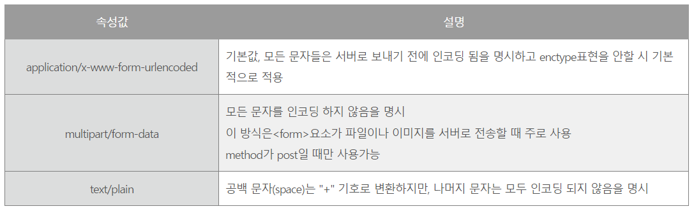

# 1. Multipart FormData

## 학습 키워드

- Multipart FormData
- `@ModelAttribute`

***

### Multipart FormData

#### form

- 입력 양식 전체를 감싸는 태그

  - name : form의 이름, 서버로 보내질 때 이름의 값으로 데이터 전송

  - action : form이 전송되는 서버 url 또는 html 링크

  - accept-charset : form 전송에 사용할 문자 인코딩 지정

  - target : action에서 지정한 url혹은 html링크의 동작방식을 설정

  - method : 전송 방법 설정. get은 default, post 3가지가 있고 post 데이터를 url에 공개하지 않고 숨겨서 전송하는 방법

  - autocomplete : 자동 완성. on으로 하면 form 전체에 자동 완성 허용

  - enctype : 폼 데이터(form data)가 서버로 제출될 때 해당 데이터가 인코딩되는 방법을 명시한다.

  

#### Multipart가 생긴 이유

- 두 종류의 데이터가 하나의 HTTP Request Body에 들어가야 하는데

- 한 Body에서 이 2 종류의 데이터를 구분에서 넣어주는 방법도 필요해졌다.

- 그래서 등장하는 것이 multipart 타입이다.

### @ModelAttribute

- 사용자가 전달하는 값을 오브젝트 형태(객체 형태)로 매핑해주는 어노테이션이다.

- 보통 폼을 통해 값을 전달할 때 자주 사용한다.

- 기존에는 JSON 데이터가 HTTP의 body(content) 부분에 그대로 전달됐기 때문에 @RequestBody 애너테이션을 사용했지만

- 여기서는 “multipart/form-data”를 사용하기 때문에 @ModelAttribute 애너테이션을 사용한다.
